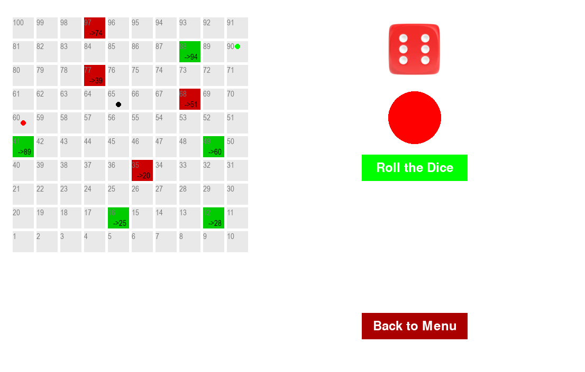
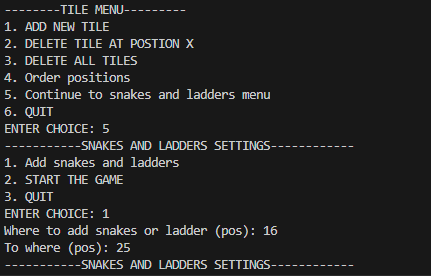

# Snake and Ladders Game

Welcome to the Snake and Ladders game! This project is implemented in Python using the Pygame library. It simulates the classic board game of Snake and Ladders, where players roll a dice and move their tokens according to the number they get on the dice.

## Installation

    pip install pygame

Run the game:

    python main.py

## How to Play

Upon running the game, you will be presented with a menu where you can customize the game settings and board layout.
Use the menu options to add or remove tiles, add snakes and ladders, and order positions according to your preference.

Once you're satisfied with the settings, start the game from the menu.
Roll the dice by clicking the "Roll the Dice" button.
Your color token automatically moves according to the number rolled on the dice.
The game will switch turns between players, whose turn colored circle will show under the dice.
Continue rolling the dice and moving your colored token until one player reaches the end of the board and wins the game.

## Customization

You can customize various aspects of the game, including the board layout and the number of players. Here are some customization options available:

Add or remove tiles at specific positions on the board.
Add snakes and ladders to create shortcuts or obstacles for the players.
Order positions to arrange the tiles in a specific sequence.
Adjust the number of players participating in the game.

## Credits

This Snake and Ladders game project was created as my Algorithms and Data Structures university module assigment. It utilizes the Pygame library for graphics and user interface.

Feel free to contribute to this project by submitting bug fixes, feature enhancements, or feedback through issues and pull requests.

Enjoy playing Snake and Ladders! 🎲🐍🪜
